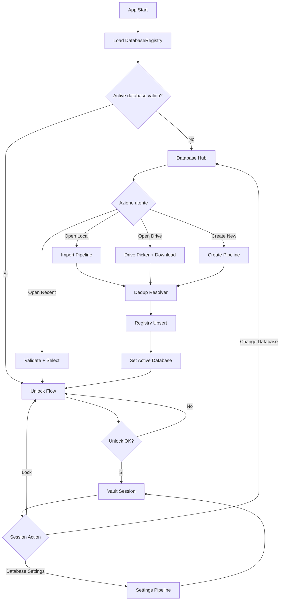
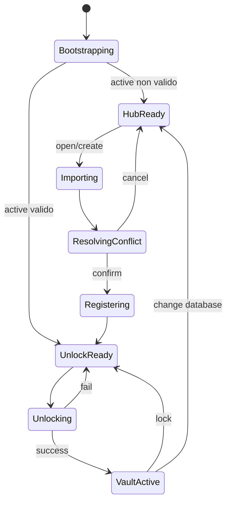

# Refactor flussi database

## Obiettivo

Semplificare la gestione dei database rendendo i flussi:
- atomici
- lineari
- modulari
- senza duplicati non intenzionali nella cartella interna dell'app
- con responsabilita' chiare tra UI, orchestrazione e persistenza

## Problemi attuali

1. Selezione database, import/copia e navigazione sono distribuiti tra UI e BLoC.
2. La gestione dei duplicati e' presente in piu' punti (UI + logica business).
3. Lo stato di sicurezza (password salvata, key file, biometria) non e' modellato in modo esplicito per singolo database.
4. Alcuni flussi simili (open, lock, change database, settings) seguono percorsi diversi.
5. Il collegamento sync con Drive e' basato sul path locale: rinomina/spostamento puo' creare inconsistenze.

## Principi target

1. Single source of truth per il ciclo di vita database.
2. Flussi transazionali con passi espliciti e rollback logico.
3. Idempotenza: ripetere un'azione non deve introdurre side effect inattesi.
4. Separazione netta dei ruoli:
   - UI: input utente e rendering stati
   - Coordinator: orchestrazione del flusso
   - Repository/Service: IO e persistenza
5. Identita' database stabile (databaseId), non basata solo sul path.

## Componenti modulari proposte

- `DatabaseSessionCoordinator`
  - Orchestrazione end-to-end: select -> import/resolve -> unlock -> sessione attiva.
- `DatabaseRegistry`
  - Catalogo locale dei database noti con metadata e dedup.
- `DatabaseImportService`
  - Pipeline unica di import/copia per local e Drive.
- `UnlockCoordinator`
  - Gestione credenziali manuali, key file e biometria per database attivo.
- `DatabaseSecurityProfileStore`
  - Persistenza impostazioni di sicurezza per singolo database.
- `SyncLinkService`
  - Collegamento tra database locale e file Drive usando identita' stabile.

## Modello dati consigliato

```text
DatabaseRecord {
  databaseId: string            // UUID stabile
  canonicalPath: string         // path locale corrente
  displayName: string
  fileHash: string?             // hash ultimo noto
  sourceType: enum              // local | drive | created
  sourceRef: string?            // es. driveFileId
  createdAt: datetime
  updatedAt: datetime
  lastOpenedAt: datetime?
  isFavorite: bool
  securityProfileId: string
}
```

### Regola dedup

Un database e' duplicato potenziale se:
1. `sourceType + sourceRef` coincide (es. stesso `driveFileId`), oppure
2. hash file coincide con record esistente.

Risoluzione dedup:
- `replace existing`
- `keep both`
- `cancel`

## Flusso macro applicativo



## Flussi atomici

### 1) Bootstrap app

Input:
- registry locale
- active database corrente

Passi:
1. Carica `DatabaseRegistry`.
2. Verifica integrita' active database.
3. Se valido -> `UnlockReady`.
4. Se non valido -> reset active e `HubReady`.

Output:
- stato iniziale deterministico (`HubReady` o `UnlockReady`).

### 2) Open existing database (locale)

Passi:
1. Acquire source dal file picker.
2. Normalize file name.
3. Import in storage interno (solo piattaforme managed).
4. Validate KDBX.
5. Dedup resolver.
6. Registry upsert.
7. Set active database.
8. Navigazione a unlock.

Atomicita':
- se fallisce prima di upsert, nessun cambio di sessione.

### 3) Open from Google Drive

Passi:
1. Ensure Drive connection.
2. Lista file `.kdbx` remoti.
3. Scelta file.
4. Download bytes.
5. Import in storage interno.
6. Dedup resolver con priorita' `driveFileId`.
7. Registry upsert (`sourceType=drive`, `sourceRef=driveFileId`).
8. Link sync.
9. Set active database.
10. Navigazione a unlock.

Atomicita':
- apertura database e link sync separati: se il link fallisce, apertura resta valida con warning.

### 4) Create new database

Passi:
1. Resolve output target.
2. Setup key file (generato o selezionato).
3. Create KDBX.
4. Save security profile.
5. Registry upsert.
6. Set active database.
7. Navigazione a unlock.

### 5) Unlock database

Passi:
1. Carica security profile del database attivo.
2. Se biometria richiesta -> challenge.
3. Tentativo unlock con credenziali disponibili.
4. Fallback manuale password/key file.
5. Su successo -> `VaultActive`.

### 6) Change database dalla vault

Passi:
1. Conferma utente.
2. Chiusura sessione attiva.
3. Clear secrets in memoria.
4. Reset active database.
5. Ritorno a Database Hub.

### 7) Remove database dal catalogo

Modalita':
- remove from list
- remove + delete file locale

Passi:
1. Conferma azione.
2. Unlink mapping sync.
3. Se active -> reset active.
4. Remove record dal registry.
5. Delete file fisico (se richiesto).
6. Cleanup security profile.

### 8) Database settings

Passi:
1. Carica settings per `databaseId` attivo.
2. Applica patch in transazione logica:
   - rename file (se richiesto)
   - update registry path
   - update sync link
   - update security profile
3. Se cambia password: re-encrypt + update credenziali sessione.
4. Reload sessione.

## Schermate riutilizzabili

1. `DatabaseHubScreen`
   - elenco database registrati + azioni principali.
2. `DatabaseSourcePickerSheet`
   - Open local / Open Drive / Create new.
3. `DatabaseImportProgressDialog`
   - stato pipeline import.
4. `DatabaseConflictDialog`
   - gestione dedup: replace / keep both / cancel.
5. `DatabaseUnlockPanel`
   - password, key file, biometria.
6. `DatabaseSecuritySettingsPanel`
   - key file, biometria, cambio password.
7. `DatabaseItemTile`
   - nome, path, size, stato sync, metadata comuni.
8. `DatabaseActionMenu`
   - open, remove, export, settings.

## Contratti consigliati

```text
DatabaseSessionCoordinator
- bootstrap()
- openLocal(fileInput)
- openDrive(remoteFileId)
- createDatabase(params)
- unlock(credentials)
- lock()
- changeDatabase()
- removeDatabase(databaseId, mode)
- updateDatabaseSettings(databaseId, patch)
```

```text
DatabaseRegistryRepository
- list()
- getById(databaseId)
- findBySource(sourceType, sourceRef)
- findByHash(hash)
- upsert(record)
- remove(databaseId)
- setActive(databaseId?)
- getActive()
```

```text
DatabaseSecurityRepository
- getProfile(databaseId)
- saveProfile(databaseId, profile)
- clearProfile(databaseId)
```

## State machine target



## Piano di migrazione incrementale

### Fase 1 - Stabilizzazione
- introdurre `DatabaseSessionCoordinator`
- centralizzare import pipeline e dedup
- mantenere UI corrente con adapter

### Fase 2 - Identita' stabile
- introdurre `DatabaseRegistry` con `databaseId`
- migrare da path-only identity
- riallineare sync mapping e security profile

### Fase 3 - Modularizzazione UI
- estrarre pannelli/schermate riutilizzabili
- ridurre logica nei widget

### Fase 4 - Hardening
- test end-to-end su open local/drive, dedup, rename, change database, unlock
- test regressione su Android/iOS/macOS (managed storage)

## Criteri di accettazione

1. Nessun duplicato non intenzionale durante import ripetuti.
2. Open local e open drive condividono la stessa pipeline.
3. Unlock sempre riferito al database attivo corretto.
4. Sicurezza (key file/biometria/password) isolata per database.
5. Change database non lascia credenziali stale in memoria.
6. Rename database non rompe il collegamento sync.
7. Flussi osservabili con stati espliciti e testabili.
